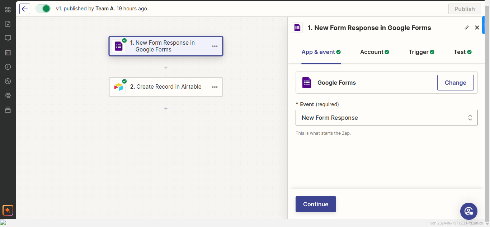
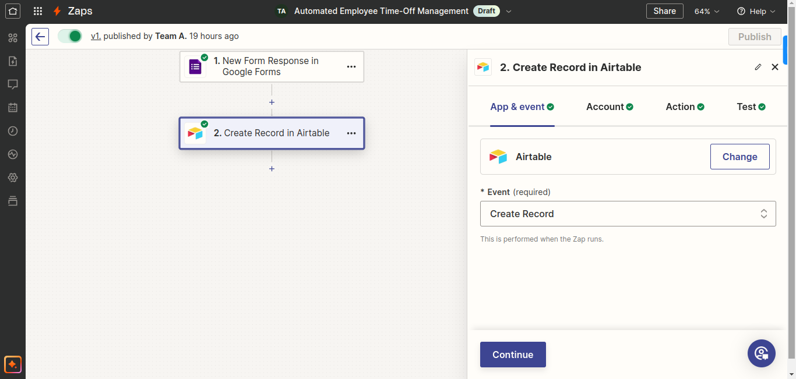

## To integrate Zapier with Airtable and send the response from Google Forms to Airtable, follow these steps:

1. Sign in to your Zapier account or create a new one if you don't have an account yet.

2. Click on "Make a Zap" to start creating a new Zap.

3. In the "Choose App & Event" section, search for and select "Google Forms" as the trigger app.

4. Choose the trigger event that you want to use, such as "New Response in Spreadsheet" or "New Submission".

5. Connect your Google Forms account by following the prompts and granting Zapier access to your Google account.

6. Select the Google Forms account and form that you want to use for the integration.

7. Test the trigger to ensure that Zapier can retrieve data from your Google Form.

8. In the "Choose App & Event" section, search for and select "Airtable" as the action app.

9. Connect your Airtable account by following the prompts and granting Zapier access to your Airtable workspace.

10. Select the Airtable base and table where you want to send the response data.

11. Map the fields from the Google Form response to the corresponding fields in your Airtable table.

12. Test the action to ensure that it performs as expected and the response data is successfully sent to Airtable.

If everything looks good, turn on your Zap to start the integration between Google Forms and Airtable.

Zapier will now automatically send the response data from your Google Form to the specified Airtable base and table.

You can customize your Zap further by adding additional steps or conditions as needed.

That's it! You have successfully integrated Zapier with Airtable to send the response from Google Forms to Airtable.

